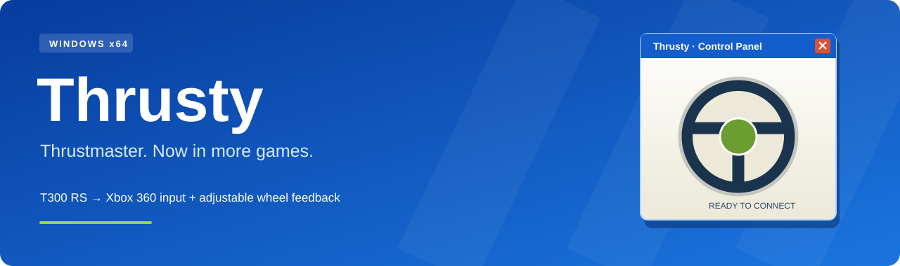

# Thrusty

**Use your Thrustmaster T300 RS in any game supporting Xbox 360 controllers, with adjustable wheel feedback and a clean simple UI.**

Thrusty maps steering, pedals and buttons into a virtual Xbox controller for applications such as GeForce NOW. When a game sends Xbox vibration back, Thrusty turns it into wheel effects. Local centering, a simulated steering response and near-center boost let you tune the feel independently.

**Download:** open this repository's **Releases** section and choose `Thrusty-1.0.0-Setup.exe`, or the portable Windows ZIP. GitHub's automatic “Source code” download does not contain a compiled application.

## Mappings

- **Wheel → controller:** steering on left stick X, accelerator on RT, brake on LT, plus buttons and D-pad diagonals.
- **Calibration and remapping:** separate pedal calibration, inversion, deadzone and steering curve.
- **0–100% centering:** full nominal driver-force commands are available at 100%, subject to the wheel's own driver settings.
- **Power-steering feel:** a lighter center, progressively firmer loading and a controlled return. This is a local approximation and doesn't pull from game telemetry.
- **Near-center boost:** firm up small corrections without increasing force at larger steering angles.
- **Feedback diagnostics:** live input meters, rumble counters, a wheel-pulse test and an Xbox-rumble round-trip test.
- **Classic Windows UI:** native C++, no Python, npm or .NET runtime required to use the app.

## Get started

1. Install the official [Thrustmaster T300 driver](https://support.thrustmaster.com/en/product/t300rs-en/) and configure **separate pedal axes**.
2. Run the Thrusty installer, or extract the portable ZIP and run `Thrusty.exe`.
3. In **Feedback & setup**, install the bundled **ViGEmBus** driver if needed. Its installer asks for administrator approval separately; Thrusty never installs it silently.
4. Click **Refresh**, select your wheel, and use **Buttons & axes** to identify the steering and pedal axes from their live readings.
5. Save, center the wheel, release the pedals, then **Calibrate**. Turn fully both ways and press each pedal fully before finishing.
6. **Start bridge before launching your game**, then select the game's Xbox/gamepad control scheme.

For wheel feedback, enable it while stopped, save, then restart the bridge. Try **centering 20–30%**, **spring reach 25%**, and **near-center boost 40%** as an initial tuning point. Start lower if the force feels excessive.

**Stop all output:** press **Ctrl + Alt + F12** or click **STOP ALL**. Thrusty reports if another application prevents registering the shortcut.

## Tune the feel

| Setting | Range | What it changes |
| --- | --- | --- |
| Rumble strength | 0–35% | Vibration synthesized from incoming Xbox motor strengths |
| Centering strength | 0–100% | Maximum local restoring force |
| Spring reach | 5–100% | Fraction of center-to-lock travel where selected centering strength is reached |
| Power-steering feel | On / off | Progressive assisted response versus linear centering |
| Near-center boost | 0–100% | Stronger small corrections; blends out within the first 40% of spring reach |
| Reverse force direction | On / off | Corrects an outward-pulling force direction |

At **100% centering**, full force is available at or beyond spring reach when held off-center; it is not continuously full torque at every angle. At the calibrated center the centering force is zero. Startup force fades in over 500 ms.

## What this can—and cannot—do

Xbox rumble carries vibration strengths, not a racing game's steering torque or vehicle telemetry. Thrusty cannot recover tire grip, road forces, understeer or vehicle speed from that signal. Its assisted feel and near-center boost are manual tuning tools and do not change automatically when a car starts moving.

GeForce NOW/controller/rumble behavior depends on the client and game. If the local Xbox-rumble test works but the game sends no rumble messages, investigate the game or streaming session. **Thrusty cannot relay feedback that never reaches the PC.**

This release supports **Windows 10/11 x64**, one saved wheel profile, two independent pedal axes and the first POV hat. Clutch input, right-stick axes, keyboard macros, physical soft locks and automatic reconnection are not included.

## Verification and dependencies

The local release build and mapping/force tests passed. Windows-native CI, installation checks and UI startup checks are included in the workflow; consult its actual results after uploading this repository. Physical T300 and GeForce NOW acceptance tests remain documented in [Hardware testing](docs/HARDWARE-TESTING.md). **Version 1.0.0 is a release identifier, not hardware certification.** See [the exact verification record](VALIDATION.txt).

ViGEm is a **retired upstream dependency**; read its [maintainer notice](https://docs.nefarius.at/projects/ViGEm/End-of-Life/). Thrusty's executables are **unsigned**, so Windows may identify an unknown publisher. The application has no telemetry, account, background service or automatic updater.

## Documentation

- [Setup and troubleshooting](docs/SETUP.md)
- [Build from source](docs/BUILDING.md)
- [Architecture and force model](docs/ARCHITECTURE.md)
- [Hardware acceptance checks](docs/HARDWARE-TESTING.md)
- [Changelog](CHANGELOG.md) · [Release notes](docs/releases/v1.0.0.md)
- [Contributing](CONTRIBUTING.md) · [Reporting security issues](SECURITY.md)
- [License](LICENSE.txt) · [Credits](CREDITS.md)

Maintained by **Ethan Eimont**. This project is not associated with Thrustmaster, Microsoft and NVIDIA or its subsidiaries.
